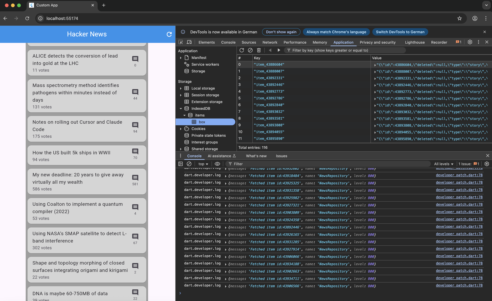

# Hacker News

A hacker News Flutter Web-Demo using Hive for caching to crawl the hacker news inefficient api of: https://hacker-news.firebaseio.com/v0



## Getting Started

Ensure you have installed flutter (>= 3.29.0 ... check using flutter --version)

just run:
```bash
flutter pub get
dart run build_runner build 
flutter run -d chrome
```

Log output is visible in the browser's console (activate in all levels: verbose).


